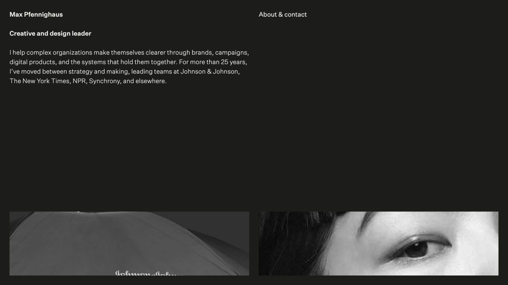

# Make Placid

An editorial portfolio template for designers, artists, photographers, architects, and creative practices.

The project is intentionally small. Its structure follows the visual system: a limited set of rules, applied consistently, with content kept separate from presentation. There is no dashboard, database, or component library to learn. Most portfolio updates happen in Markdown and YAML.

**[Open the template demo](https://maxpfennig.haus/make-placid-portfolio/)** · **[View a live portfolio based on the system](https://maxpfennig.haus)** · **[Use this template](https://github.com/new?template_name=make-placid-portfolio&template_owner=mxpf)**



## Why it exists

Make Placid is the foundation for [Max Pfennighaus’s portfolio](https://maxpfennig.haus): keep the source portable, keep publishing explicit, and keep the interface quiet enough for the work to remain the subject.

The template carries those production lessons into a reusable portfolio system. It is statically exported, independently hostable, free of runtime services, and designed to remain understandable after a long absence.

## Design philosophy

Minimalism here means clarity, not absence. The design creates rhythm through proportion, spacing, typography, and the relationship between image and text.

- **One spatial language.** A 12-pixel base unit governs the interface. Margins, gutters, leading, and standard gaps are 24 pixels; selected editorial intervals use 36 pixels.
- **Four columns, deliberately used.** On desktop, the project description remains anchored in the left column while the work scrolls in the right. The homepage uses the same grid without adding unnecessary navigation or decoration.
- **Images retain their character.** Homepage thumbnails use a consistent 3:2 crop for rhythm. Project galleries accept varied proportions, allowing each asset to determine its own presence.
- **Typography behaves editorially.** The layout favors readable measure, stable leading, balanced wrapping, and desktop-only hanging punctuation and bullets.
- **Motion remains quiet.** Page transitions, link states, image enlargement, and thumbnail rollovers provide orientation without becoming the subject.
- **Mobile is its own mode.** The layout becomes a direct single-column sequence. Desktop image-detail behavior is removed rather than compressed into an awkward touch interaction.
- **The content model stays visible.** One folder equals one project. One file contains the site's identity. The architecture is easy to understand by looking at it.

## Features

- Fluid four-column desktop and single-column mobile layouts
- Fixed desktop navigation and project description column
- Strict 3:2 homepage thumbnails with adjustable focal points
- Mixed-ratio project galleries
- Static images, hosted video, web banners, and poster-led YouTube embeds
- Optional image and video captions
- Desktop image-detail view with click, Escape, and arrow-key controls
- Subtle homepage image zoom on hover
- Content-driven identity, metadata, About page, and projects
- Configurable project-level search and social metadata
- Responsive WebP image variants generated at build time
- Optional homepage project labels, disabled by default
- Reduced-motion support and visible keyboard focus states
- Local image assets with no runtime image service dependency

## Requirements

- [Node.js](https://nodejs.org/) 22.13 or newer
- npm, included with Node.js

## Installation

Clone the repository, install its dependencies, and start the local development server:

```bash
git clone https://github.com/mxpf/make-placid-portfolio.git
cd make-placid-portfolio
npm install
npm run dev
```

Open the local URL printed in the terminal. Changes to content, components, and styles update during development.

## First-time setup

### 1. Set the portfolio identity

Edit `content/site.yml`:

```yaml
name: "Your Name"
description: "Selected design and creative direction."
url: "https://portfolio.example.com"
language: "en"
locale: "en_US"
keywords:
  - "design"
  - "portfolio"
email: "studio@example.com"
location: "City, Country"
aboutLabel: "About & contact"
closeLabel: "Close"
projectsLabel: "Selected projects"
showProjectLabels: false
socialImage: "/og.png"
socialImageAlt: "Your Name — selected work"
favicon: "/favicon.png"
appleTouchIcon: "/apple-touch-icon.png"
```

These values populate the navigation, canonical URLs, search metadata, link previews, icons, accessibility labels, and reusable fields on the About page. The project also generates `robots.txt` and `sitemap.xml` from this configuration.

### 2. Write the About page

Edit `content/about.md`. The following tokens are replaced with values from `content/site.yml`:

- `{{name}}`
- `{{email}}`
- `{{location}}`

Standard Markdown is supported, including paragraphs, links, lists, and block quotations.

### 3. Set the typography

The distributable template includes [Instrument Sans](https://github.com/Instrument/instrument-sans) under the SIL Open Font License. Its license is included at `public/fonts/OFL.txt`.

For a privately licensed font, place a regular WOFF2 file at:

```text
public/fonts/portfolio-custom.woff2
```

Then create a private environment file from the included example and enable the custom font:

```bash
cp .env.example .env.local
```

```text
NEXT_PUBLIC_PORTFOLIO_CUSTOM_FONT=true
```

Both `.env.local` and `portfolio-custom.woff2` are ignored by Git and are never included in the distributable repository. With the flag left `false`, the template uses Instrument Sans and does not request the private font file. Confirm that your font license permits web embedding on your own deployment.

### 4. Replace the social and icon images

Replace `public/og.png` with a landscape preview image for link sharing. If the filename changes, update `socialImage` in `content/site.yml`.

Replace `public/favicon.png` and `public/apple-touch-icon.png` with your own square brand assets, then update their paths in `content/site.yml` if necessary.

### 5. Replace the demonstration work

Store portfolio assets under `public/`, organized however you prefer. For example:

```text
public/
  images/
    project-name/
  videos/
    project-name/
```

Paths in project files begin at `public/`, so `public/images/project-name/cover.jpg` becomes `/images/project-name/cover.jpg`.

## Working with projects

Each project lives in its own folder:

```text
content/projects/
  project-name/
    project.md
```

The folder name becomes the URL slug. A project at `content/projects/exhibition/project.md` appears at `/projects/exhibition`.

A complete project file looks like this:

```markdown
---
title: "Exhibition Identity"
homepageLabel: "Exhibition"
seoDescription: "A concise exhibition identity across print and space."
socialImage: "/images/exhibition/social.jpg"
order: 1
published: true
thumbnail:
  src: "/images/exhibition/thumbnail.jpg"
  alt: "Exhibition poster installed on a concrete wall"
  focalX: 50
  focalY: 42
media:
  - kind: image
    id: "poster"
    src: "/images/exhibition/poster.jpg"
    ratio: "4 / 5"
    alt: "Black-and-white exhibition poster"
    caption: "Poster, offset lithography, 2026."
---

Exhibition Identity

A concise description of the project, its context, and the work shown.
```

Use `order` to control homepage position. Set `published: false` to keep a project in the repository without displaying it on the site.

`homepageLabel`, `seoDescription`, and `socialImage` are optional. The label falls back to the full project title, while the project social image falls back to its homepage thumbnail and then the site-wide social image.

### Homepage thumbnails

Homepage thumbnails are always displayed at 3:2. Supply a dedicated 3:2 image when possible; other proportions are cropped automatically.

Use `focalX` and `focalY` to position the crop. Both accept values from `0` to `100`, with `50` representing the center.

Set `showProjectLabels: true` in `content/site.yml` to show the optional labels beneath homepage thumbnails. The default is `false`, preserving the image-only homepage.

To preview labels privately without changing the distributable default, add `NEXT_PUBLIC_SHOW_PROJECT_LABELS=true` to `.env.local`.

### Project media

Project galleries support three media types.

#### Image

```yaml
- kind: image
  id: "project-image"
  src: "/images/project/image.jpg"
  ratio: "4 / 5"
  alt: "A concise visual description"
  caption: "An optional caption."
```

#### Hosted video

```yaml
- kind: video
  id: "hosted-video"
  src: "/videos/project/film.mp4"
  poster: "/images/project/film-poster.jpg"
  ratio: "16 / 9"
  title: "Film title"
  caption: "An optional caption."
```

Hosted videos remain paused until selected and use a minimal play symbol over the poster image.

#### YouTube

```yaml
- kind: youtube
  id: "youtube-video"
  youtubeId: "VIDEO_ID"
  poster: "/images/project/youtube-poster.jpg"
  ratio: "16 / 9"
  title: "Film title"
  caption: "An optional caption."
```

The custom poster keeps YouTube chrome out of the composition until playback begins. If no poster is provided, the standard embed presentation is used.

Ratios use CSS aspect-ratio syntax, such as `3 / 2`, `4 / 5`, `1 / 1`, or `16 / 9`. Captions are optional. When present, the layout applies the design's larger caption interval automatically.

### Complete demonstration project

`content/projects/project-03/project.md` demonstrates every supported content and media feature in one case study:

- Headings, paragraphs, lists, a block quotation, and an external link
- Static images with and without captions
- Hosted video with a poster
- YouTube video with a custom poster
- Multiple project-image proportions
- Project-specific homepage and search metadata

Use it as a reference while creating a new project, then replace or remove it before launch.

## Responsive images

The source photographs remain in their original locations. A build-time script creates optimized WebP candidates at several widths and records their dimensions in a generated manifest. The components use `srcset` and `sizes` so browsers download an appropriate file for mobile, a desktop column, or the full-width detail view.

Generate variants manually after adding or replacing images:

```bash
npm run images
```

The same command runs automatically before every production build. No runtime image service or third-party image request is required.

## Interaction

On desktop:

- Select a homepage image to open its project.
- Select a project image to open the full-width detail view.
- Select the expanded image or press Escape to close it.
- Use the left and right arrow keys to move between project images.
- Select the name to return to the top of the homepage.
- Open About and use Close to return to the previous page position.

On mobile, the project gallery remains inline and image-detail mode is disabled.

## Styling

Global design tokens and layout rules live in `app/globals.css`. The primary variables are defined at the top of the file:

```css
:root {
  --spacing-1: 12px;
  --spacing-2: 24px;
  --spacing-3: 36px;
  --dark: #1c1c1a;
  --light: #f7f6f2;
  --link: #70706c;
}
```

Changing these values updates the system globally. Preserve the relationships between them if you want to retain the original rhythm.

## Project structure

```text
app/                  Pages, metadata, and global styles
components/           Navigation, transitions, and project interactions
content/              Site identity, About copy, and project content
lib/content.ts        Content loading and Markdown rendering
public/               Fonts, images, videos, and social assets
scripts/              Authoring utilities, including image generation
tests/                Rendered-route checks
```

## Commands

| Command | Purpose |
| --- | --- |
| `npm run dev` | Start the local development server |
| `npm run images` | Generate responsive WebP image variants |
| `npm run build` | Create the static production export in `out/` |
| `npm run verify:export` | Check the export for missing local routes and assets |
| `npm test` | Build, verify the export, and check the rendered routes |
| `npm run lint` | Check the source for common issues |
| `npm run typecheck` | Check TypeScript without emitting files |

Run the full verification sequence before publishing:

```bash
npm test
npm run lint
npm run typecheck
```

The repository also runs a weekly dependency audit. Production dependency failures block publication; development-tool findings are reported separately so they can be addressed without quietly taking the demo offline.

## Publishing checklist

- Replace the example name, biography, email address, and project copy.
- Replace or approve the licensed demonstration images and example video embeds.
- Replace `public/og.png`.
- Replace the favicon and Apple touch icon.
- Update `url`, language, locale, keywords, and social-image text in `content/site.yml`.
- Confirm every meaningful image has accurate alternative text.
- Keep third-party image and media credits current.
- Keep privately licensed fonts in the ignored `portfolio-custom.woff2` slot.
- Run the tests and lint checks.

## Licensing

The software is available under the [MIT License](LICENSE). Third-party fonts, photographs, and remote media retain their original licenses or terms and are documented in [THIRD_PARTY_NOTICES.md](THIRD_PARTY_NOTICES.md).

Instrument Sans is included under the SIL Open Font License 1.1. The Unsplash demonstration credits are recorded in `content/image-credits.md`. The optional `portfolio-custom.woff2` file is deliberately excluded from the repository and the MIT-licensed distribution.

## Deployment

`npm run build` produces a complete static site in `out/`. Publish that directory with GitHub Pages, Cloudflare Pages, Netlify, Vercel, or any other static host. No server, database, or runtime image service is required.

The included GitHub Actions workflow publishes the demonstration site whenever `main` changes. It tests the normal domain-root build first, then creates a second export configured for the repository subpath.

For your own GitHub Pages project site, update the two values in `.github/workflows/publish-demo.yml`:

```yaml
NEXT_PUBLIC_BASE_PATH: /your-repository-name
NEXT_PUBLIC_SITE_URL: https://your-account.github.io/your-repository-name
```

Then enable **Settings → Pages → GitHub Actions**. The workflow deploys `out/`, and the export verifier fails if any internal page, image, stylesheet, script, or responsive-image candidate is missing.

When hosting at a custom domain root, leave `NEXT_PUBLIC_BASE_PATH` empty and set `NEXT_PUBLIC_SITE_URL` to the public origin. The same source can therefore serve a root domain, a GitHub project site, or another static host without rewriting content paths.

## Release status

Version 1.0.0 establishes the reusable deployment contract: static-export verification, project-subpath support, automated demo publishing, dependency checks, and the complete demonstration content set. See [CHANGELOG.md](CHANGELOG.md) for the release record.
